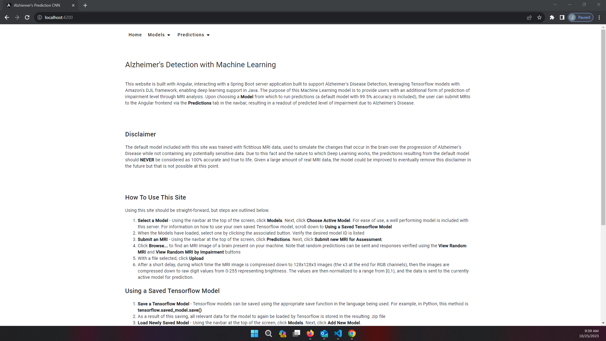
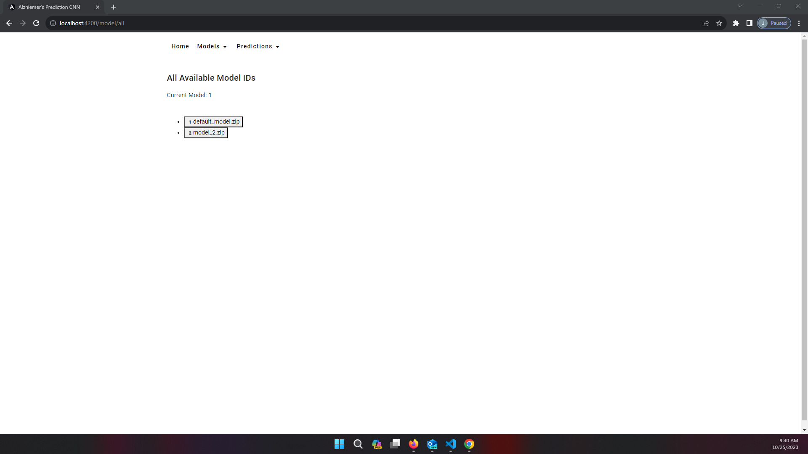
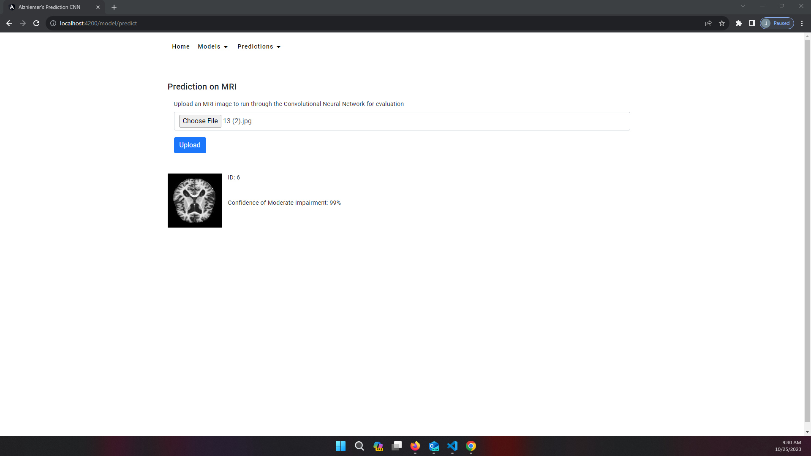

# Alzheimer's Disease Detection CNN - Spring Boot
 

  
Table of Contents

  <ol>
    <li><a href="#description">Description</a></li>
    <li><a href="#key-points">Key Points</a></li>  
    <li><a href="#implementation-details">Implementation Details</a></li>  
    <ul>
      <li><a href="#usecases">Usecases</a></li>
      <li><a href="#test-cases">Test Cases</a></li>
      <li><a href="#backend-implementation">Backend Implementation</a></li>
      <li><a href="#frontend-implementation">Frontend Implementation</a></li>
      <li><a href="#pending-work">Pending Work</a></li>
      <li><a href="#open-questions">Open Questions</a></li>
    </ul>
    <li><a href="#contact">Contact</a></li>
  </ol>

## Description

  This Spring Boot server is primarily designed for diagnosing Alzheimer's Disease (AD) using synthetic or fictitious MRI images. Serving as a launching pad for future full-stack 
  endeavors that integrate machine learning, this project encapsulated a total 6 weekdays, averaging 9 hours of work per day. While certainly limited to just fictitious images,
  this project provides a valuable foundation for learning, research, and innovation in the fields of Full Stack Java development and Machine Learning with Python integration.

(<a href="#readme-top">back to top</a>)

## Key Points
<ol>
  <li><b>Synthetic MRI Analysis:</b> The server specializes in analyzing synthetic MRI images to simulate the diagnosis of AD with the assistance of AI</li>
  <li><b>Educational and Research Tool:</b> This project provides a controlled environment for healthcare professionals, students and researchers to realize the impact AI could provide in early diagnosis of AD</li>
  <li><b>Explore Machine Learning Integration:</b> As a starting point, this project demonstrates the potential integrations of Machine Learning into a Full Stack solution</li>
  <li><b>Use of Real Data:</b> Due to the server supporting the injection of custom saved Tensorflow models, upon the development of a model that has high accuracy with real MRI images, that model can be loaded into this site and predictions with real MRI images can be run. Note one should never take the findings of this ML model over their own medical providers</li>
</ol>

(<a href="#readme-top">back to top</a>)

## Implementation Details

### Usecases
 <table>
  <tr>
    <th>Name</th>
    <th>Description</th>
    <th>Finished</th>
    <th>Notes</th>
  </tr>
  <tr>
    <td>User desires to see all models available to predict against</td>
    <td>
      <ol>
        <li>The user accesses the Angular frontend</li>
        <li>The user can access the view all models endpoint to see all available models and select one</li>
        <li>The Angular frontend queries the Spring Boot server to return this list of all models</li>
        <li>On selection of a model, that model is treated as the 'active' model in Angular</li>
      </ol>
    </td>
    <td>&check;</td>
  </tr>
  <tr>
    <td>User wishes to upload their own saved Tensorflow model</td>
    <td>
      <ol>
        <li>The user accesses the Angular frontend</li>
        <li>The user selects the option to upload a saved model</li>
        <li>The user uploads their model</li>
        <li>The Angular frontend sends the uploaded file to the Spring Boot server</li>
        <li>If the file passes some preconditions, it is loaded into Tensorflow</li>
        <li>Success or failure returned to Angular
        <li>On success, the user can access the view all models endpoint to see the new model and select it if desired</li>
      </ol>
    </td>
    <td>&check;</td>
  </tr>
  <tr>
    <td>User desires to see information about the currently selected model</td>
    <td>
      <ol>
        <li>The user accesses the Angular frontend</li>
        <li>The user selects the option to view current model details</li>
        <li>The Angular frontend sends a get request for the current model to the Spring Boot server</li>
        <li>The Spring Boot server checks if the desired model is in the database, and if true, return the model</li>
        <li>Success of failure returned to Angular</li>
      </ol>
    </td>
    <td>&#10005;</td>
    <td>Currently not many details to show, only model ID and name</td>
  </tr>
  <tr>
    <td>User desires to delete the currently active model</td>
    <td>
      <ol>
        <li>The user accesses the Angular frontend</li>
        <li>The user has already selected a model to be active, or must do so now. See prior usecase for more details</li>
        <li>The user navigates to the delete endpoint</li>
        <li>The user confirms their desire to delete the active model</li>
        <li>The Angular server sends the delete request to the Spring Boot backend</li>
        <li>If the modelId==1, the Spring Boot server returns a failure, we cannot delete the default model</li>
        <li>The Spring Boot server deletes the desired model by ID from the in-memory models and the database</li>
        <li>User is able to make requests after this because Angular has reset its active model back to default</li>
      </ol>
    </td>
    <td>&check;</td>
  </tr>
  <tr>
    <td>User desires to delete all currently loaded models</td>
    <td>
      <ol>
        <li>The user accesses the Angular frontend</li>
        <li>The user access the delete all models endpoint</li>
        <li>The user confirms their desire to delete all models</li>
        <li>The Angular server sends the delete request to the Spring Boot backend</li>
        <li>All models except the default model are removed from the Spring Boot in-memory models and the database</li>
        <li>Success or failure returned to Angular</li>
        <li>User is able to make requests after this because Angular has reset its active model back to default</li>
      </ol>
    </td>
    <td>&check;</td>
  </tr>
  <tr>
    <td>User desires to have an MRI of their own or someone close to them analyzed</td>
    <td>
      <ol>
        <li>The user accesses the Angular frontend</li>
        <li>The user selects a model from which to predict their MRI</li>
        <li>The user uploads their MRI to Angular</li>
        <li>Angular sends the MRI image to the Spring Boot server</li>
        <li>The Spring Boot server processes the file, ensuring its an image, and passing it to the predictive model</li>
        <li>The Spring Boot server returns the result to the Angular server</li>
        <li>The Angular service shows a predicted level of Impairment due to AD with a confidence rating</li>
      </ol>
    </td>
    <td>&check;</td>
  </tr>
  <tr>
    <td>User desires to see how the predictive model works with a random test image</td>
    <td>
      <ol>
        <li>The user accesses the Angular frontend</li>
        <li>The user selects a model from which to predict their MRI</li>
        <li>The user selects the option for random prediction in Angular</li>
        <li>Angular sends a random prediction request to the Spring Boot server</li>
        <li>The Spring Boot server finds a random image and passes it to the predictive model</li>
        <li>The Spring Boot server returns the result to the Angular server</li>
        <li>The Angular service shows a predicted level of Impairment due to AD with a confidence rating. Because this was one of the supplied test 
        images, the actual value of Impairment will also be shown</li>
      </ol>
    </td>
    <td>&check;</td>
  </tr>
  <tr>
    <td>User wishes to get the results from a prior MRI prediction</td>
    <td>
      <ol>
        <li>The user accesses the Angular frontend</li>
        <li>The user selects the model from which the prediction was originally fetched</li>
        <li>The user selects the option to get prediction by ID in Angular</li>
        <li>The user inputs the desired prediction ID to fetch</li>
        <li>Angular sends the get request to the Spring Boot server</li>
        <li>The Spring Boot server searches its database of predictions and returns the result if present</li>
        <li>The Angular service shows the predicted levels of Impairment for that MRI image</li>
      </ol>
    </td>
    <td>&check;</td>
  </tr>
  <tr>
    <td>For security, user wishes to delete MRI image from prediction database</td>
    <td>
      <ol>
        <li>The user accesses the Angular frontend</li>
        <li>The user selects the option to delete prediction by ID in Angular</li>
        <li>The user inputs the desired prediction ID to delete</li>
        <li>Angular sends the get request to the Spring Boot server</li>
        <li>The Spring Boot server searches its database of predictions and deletes the desired entry</li>
        <li>Success or failure returned to Angular</li>
        <li>Angular reports result</li>
      </ol>
    </td>
    <td>&check;</td>
  </tr>
</table> 

(<a href="#readme-top">back to top</a>)

### Test Cases
<table>
  <tr>
    <th>Description</th>
    <th>Automated Spring Boot</th>
    <th>Automated Angular</th>
    <th>Notes</th>
  </tr>
  <tr>
    <td>Start server, verify it comes up as expected</td>
    <td>&#10005;</td>
    <td>&#10005;</td>
  </tr>
  <tr>
    <td>Stop server, clean shutdown. Verify DB persists on restart</td>
    <td>&#10005;</td>
    <td>&#10005;</td>
  </tr>
  <tr>
    <td>Stop server, kill. Verify DB persists on restart</td>
    <td>&#10005;</td>
    <td>&#10005;</td>
  </tr>
  <tr>
    <td>Load default model, verify predictions</td>
    <td>&check;</td>
    <td>&#10005;</td>
  </tr>
  <tr>
    <td>Load new model, verify predictions</td>
    <td>&check;</td>
    <td>&#10005;</td>
  </tr>
  <tr>
    <td>Load invalid model, verify Bad Request</td>
    <td>&check;</td>
    <td>&#10005;</td>
  </tr>
  <tr>
    <td>Get info on loaded model. Accuracy, loss, etc..</td>
    <td>&#10005;</td>
    <td>&#10005;</td>
    <td>No accuracy/loss saved in database currently</td>
  </tr>
  <tr>
    <td>Get info on invalid model ID, verify Not Found</td>
    <td>&check;</td>
    <td>&#10005;</td>
  </tr>
  <tr>
    <td>Delete model with valid model ID</td>
    <td>&check;</td>
    <td>&#10005;</td>
  </tr>
  <tr>
    <td>Delete model with invalid model ID, verify Not Found</td>
    <td>&check;</td>
    <td>&#10005;</td>
  </tr>
  <tr>
    <td>Run prediction for an MRI file, verify confidence returned</td>
    <td>&check;</td>
    <td>&#10005;</td>
  </tr>
  <tr>
    <td>Run prediction for invalid MRI file, verify Bad Request</td>
    <td>&check;</td>
    <td>&#10005;</td>
  </tr>
  <tr>
    <td>Run prediction for random file in Impairment category, verify confidence returned</td>
    <td>&check;</td>
    <td>&#10005;</td>
  </tr>
  <tr>
    <td>Verify unable to run predictions invalid Impairment category, verify Bad Request</td>
    <td>&check;</td>
    <td>&#10005;</td>
  </tr>
  <tr>
    <td>Run prediction for random test image, verify confidence returned</td>
    <td>&check;</td>
    <td>&#10005;</td>
  </tr>
  <tr>
    <td>Verify unable to run predictions for invalid model ID, verify Bad Request</td>
    <td>&check;</td>
    <td>&#10005;</td>
  </tr>
</table>

(<a href="#readme-top">back to top</a>)

### Backend Implementation

  The backend server is implemented with Spring Boot, utilizing an H2 database that persists on disk. The Rest API exposed by this server supports most 
  basic CRUD requests to interact with both Tensorflow models and individual MRI prediction.
     
  None of the model training occurs on this Spring Boot server. While we are leveraging Amazon's DJL framework that enables Deep Learning support in Java, 
  the models were all trained using the Neural Network found at the following link:

<a href="https://github.com/jtrull101/alz-mri-neural-network">Python Alzheimer's Convolutional Neural Network</a> 

(<a href="#readme-top">back to top</a>)

### Frontend Implementation

  The frontend server is implemented with Angular and serves as a simplistic yet clean interface to interact with the Spring Boot server than the Rest API. 
  The home page can be seen below, accessed at http://localhost:4200

  From the homepage, a user can navigate to one of several options under both the <b>Models</b> and <b>Predictions</b> headers. 
  In this readme, we've just shown the pages required to access to submit a prediction to the default model. To choose the default model, navigate to 
  <b>Models</b> -> <b>Choose Active Model</b>. Click one of the following options and verify the text stating 'Current Model: {ID}' updates correctly. 
  The default model will always have ID == 1.

  Next, navigate to <b>Predictions</b> -> <b>Submit new MRI for Assessment</b> to see the next screenshot shown below. From here, choose a file to upload to the 
  predictive model that you have chosen. For convenience, test images (that the default model was not trained on) are included in 
  src/main/resources/images/Combined Dataset.zip. Unzip this and choose an image. Each fictitious MRI in this dataset is sorted by the Impairment level that the MRI 
  was emulating. Because of this fact, we will have confidence if the model is performing as expected after uploading some MRIs and verifying their predictions
  match our actual value.

(<a href="#readme-top">back to top</a>)

### Pending Work
<ul>
  <li>Automated testing for Angular frontend - using Karma: https://karma-runner.github.io/6.4/index.html</li>
  <li>Increase test coverage for Spring Boot server</li>
  <li>Angular frontend not handling exceptions from the backend</li>
  <li>Implement safer keys in the database. Currently just incrementing
  <li>Add Users - should have their own inventory of models and predictions</li>
  <li>SSL for security when dealing with real data</li>
  <li>Fix concurrency issues</li>
  <li>Remove test images from Angular server, rely on images in backend</li>
  <li>Fix packaging of final jar - currently not executable</li>
</ul>

(<a href="#readme-top">back to top</a>)

### Open Questions
<ul>
  <li>When running predict() on an image, should we run predict for every model? (under user?)</li>
</ul>

(<a href="#readme-top">back to top</a>)

## Contact

Email: jttrull0@gmail.com

<a href="https://www.linkedin.com/in/jonathan--trull/">LinkedIn</a> 
<a href="https://github.com/jtrull101">GitHub</a>

(<a href="#readme-top">back to top</a>)

 

